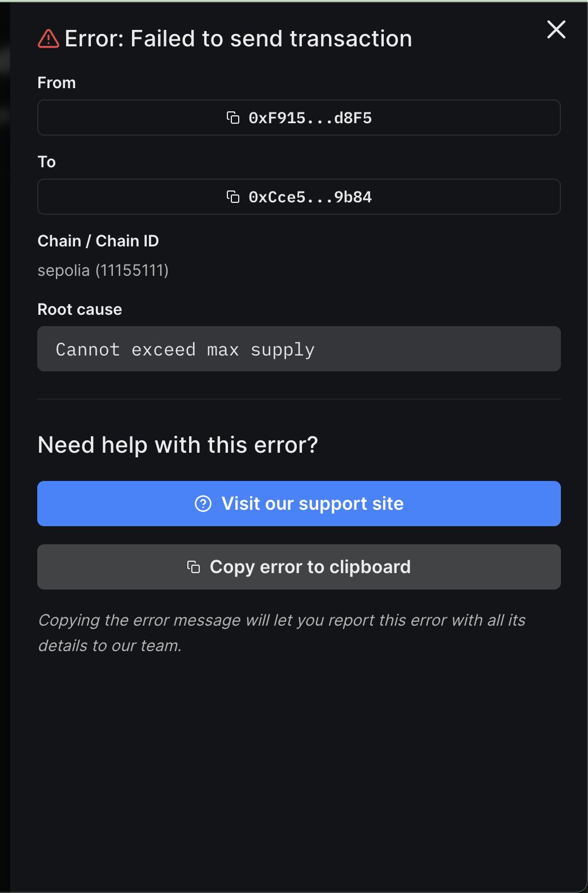

# erc20-base-max-supply

ERC20BaseMaxSupply inherits from [Thirdweb's ERC20Base](https://github.com/thirdweb-dev/contracts/blob/main/contracts/base/ERC20Base.sol) with adding constraint maximum total supply. Ensure we get an error when trying to mint exceed the limit 

## Prerequisites

The following tools need to be installed:

* [Git](http://git-scm.com/)
* [Node.js 18+](http://nodejs.org/)

## Capabilities and Frameworks

| Capability           | Module                                                                                                                                                                                                                                                                                                                                                                                                                                                                                                     |
| -------------------- | ---------------------------------------------------------------------------------------------------------------------------------------------------------------------------------------------------------------------------------------------------------------------------------------------------------------------------------------------------------------------------------------------------------------------------------------------------------------------------------------------------------- |
| Dependence Framework | [`@thirdweb-dev/contracts`](https://www.npmjs.com/package/@thirdweb-dev/contracts) collection of smart contracts deployable via the thirdweb SDK, dashboard and CLI |
| Build Tools          | [`thirdweb CLI`](https://github.com/thirdweb-dev/js/tree/main/legacy_packages/cli) provides tools to create, build, and deploy projects using thirdweb tools and infrastructure. Using the CLI, you can create new projects with the SDK configured, build, publish and deploy smart contracts, generate types while developing, upload files to IPFS, and more, [hardhat-javascript-starter](https://github.com/thirdweb-example/hardhat-javascript-starter)  thirdweb contracts starter project for Hardhat & TypeScript|
| Coding Standard      | [solhint](https://github.com/protofire/solhint) is an open-source project to provide a linting utility for Solidity code.                                                                  |
| Useful Links         | [solidity cheatsheet](https://docs.soliditylang.org/en/develop/cheatsheet.html) quick reference solidity syntax, [Introduction to Smart Contracts](https://docs.soliditylang.org/en/develop/introduction-to-smart-contracts.html) understand basic knowledge, [Structure of a Contract](https://docs.soliditylang.org/en/develop/structure-of-a-contract.html) |

## Lint the project

```bash
npm run lint
# or
yarn lint
```

## Building the project

After any changes to the contract, run:

```bash
npm run build
# or
yarn build
```

to compile your contracts. This will also detect the [Contracts Extensions Docs](https://portal.thirdweb.com/contractkit) detected on your contract.

## Deploying Contracts

When you're ready to deploy your contracts, just run one of the following command to deploy you're contracts:

```bash
npm run deploy
# or
yarn deploy
```

## Publishing Contracts

If you want to publish a version of your contracts publicly, you can use one of the followings command:

```bash
npm run publish
# or
yarn publish
```

## Collaboration

1. Follow [Solidity style-guide](https://docs.soliditylang.org/en/latest/style-guide.html)
2. Reuse [Common Patterns](https://docs.soliditylang.org/en/develop/common-patterns.html)
3. Use readable commit message [karma](http://karma-runner.github.io/6.3/dev/git-commit-msg.html)

```bash
     /‾‾‾‾‾‾‾‾
🔔  <  Ring! Please use semantic commit messages
     \________


<type>(<scope>): ([issue number]) <subject>
    │      │        |             │
    |      |        |             └─> subject in present tense. Not capitalized. No period at the end. 
    |      |        |  
    │      │        └─> Issue number (optional): Jira Ticket or Issue number 
    │      │
    │      └─> Scope (optional): eg. Articles, Profile, Core
    │                                                                           
    └─> Type: chore, docs, feat, fix, refactor, style, ci, perf, build, or test.
```
